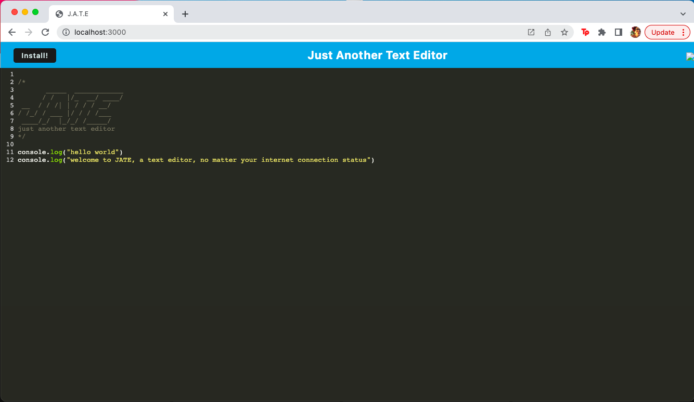

# Just Another Text Editor
  

## Description
This progressive web application, JATE, allows you to create notes and code snippets on your device and will save your work no matter your internet connection status.

## Table of Contents
- [Installation](#installation)
- [Usage](#usage)
- [License](#license)
- [Contributing](#contributing)
- [Tests](#tests)
- [Questions](#questions)
- [Visuals](#visuals)

## Installation

To run this application you can simply click on the deployed link found below. Once at the application page, hosted by Heroku, you will find there is also the option to install the application directly to your device. Upon installation, an icon will save to your desktop or dashboard and clicking it will take you directly to the application.

If you are interested in working with the development side of this application, be sure to run your integrated terminal from the root, this will enable you to run specific commands that control both the client and servere sides. If this is the first time running the application in development, sure to run npm i to get all of your dependencies installed, there are three package.json in this application: at the root, in the client and in the server. To launch the application the command npm start will run build then start up the back end and serve the client. However you can browse the necessary scripts to suit your purposes at the package.json in the root file.

## Usage

This full stack progressive web application will allow you the possibility to work online and offline to compose and save text and code snippets.

This seemingly simple application is actually achieved using complex web development concepts. This PWA uses webpack plugins which allows our resources to be bundles to optimize performance and generate HTML. It utilizes a service worker to allow the application to work offline and again improves performance in that it the application will first access cached files before making a call to server. The user data is stored in an indexedDB, which is an API library that we bring in via a node module to store, access, and manipulate user data. Indexed databases allow for full CRUD operations while this particular application offers GET and PUT functionality. 

## License
  
  This project uses the Mozilla_Public_License_2.0 license. 
  **If you have questions on the license please check the following site [choose a license](https://www.google.com)

## Contributing

If you wish to contribute please send a message to my email, found below.

## Tests

There is no testing in place for this application.

## Questions

Please feel free to explore my other projects on github: [tracyroseguajardo](https://www.github.com/tracyroseguajardo)

If you have further questions you may send me an email at: tracyroseguajardo@gmail.com

## Visuals

Link to deployed application:
[Text Editor](https://desolate-shelf-99414.herokuapp.com/)

Screenshot of application:
